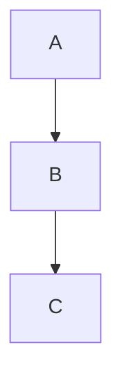

# Editor Mini-Spec

---

## 🧩 Component Mini-Spec: Report Editor (TipTapEditor)

---

### 🎯 Goal

Create a rich text editor component for writing daily or weekly reports with the following features:

- Markdown-style formatting (bold, italic, headings, etc.)
- Code block support with syntax highlighting
- Mermaid.js diagram rendering
- Inline image handling (paste/upload)
- Autosave logic
- Keyboard shortcut: `Ctrl+Enter` triggers `saveReport` server action
- AI suggestion hook integration (optional for now; placeholder is fine)

---

### 📦 Libraries & Dependencies

- **TipTap (React)** — rich-text editor base
- **@tiptap/extension-code-block-lowlight** — for code blocks
- **lowlight** — syntax highlighting
- **Mermaid.js** — for rendering diagrams
- **react-dropzone** — for image upload (optional)
- **react** and **typescript** — assumed default

---

### 🧠 Functional Behavior

#### Basic Editor Features

- Supports: bold, italic, underline, strike, heading levels, bullet/numbered lists, blockquote, code block.
- Renders Mermaid blocks inside fenced code blocks:



#### Editor Behavior

| **Feature**       | **Details**                                                                 |
|--------------------|-----------------------------------------------------------------------------|
| **Autosave**       | Debounced or on-blur save using `saveReport()`                              |
| **Shortcut Save**  | `Ctrl+Enter` or `Cmd+Enter` to trigger manual save                          |
| **Image Upload**   | Drag & drop or paste to embed images (Base64 for now)                       |
| **AI Suggestions** | Integrate `useAiAssist.ts` (optional/stub placeholder OK)                   |
| **Dark Mode**      | Inherit styling from parent or system theme                                 |
| **Editable Prop**  | Accept a boolean `editable` prop (to enable view-only mode)                 |

---

### 🧪 Dev & Component Breakdown

| **File**                                      | **Purpose**                                                   |
|-----------------------------------------------|---------------------------------------------------------------|
| `components/editor/TipTapEditor.tsx`          | Main component with all extensions and behavior               |
| `components/editor/extensions/mermaidExtension.ts` | Custom extension to render Mermaid blocks                     |
| `components/editor/EditorToolbar.tsx`         | Optional toolbar (formatting actions)                         |
| `hooks/useAutoSave.ts`                        | Manages debounce save logic                                   |
| `lib/ai/active/aiAssistInEditor.js`           | Already exists; placeholder call on editor input              |

---

### 🔁 Integration Points

- ✅ Call `saveReport()` from `app/report/actions/saveReport.js`
- ✅ Consume AI suggestions via `useAiAssist.ts` and display inline or sidebar (mock for now)
- ✅ Save `editorContent` as JSON or HTML (up to backend spec; likely HTML)

---

### 🧩 Props Interface (Proposal)

```typescript
interface TipTapEditorProps {
    defaultValue?: string; // existing content (HTML)
    editable?: boolean;    // false = read-only mode
    onSave?: (content: string) => void; // triggered on save or autosave
    suggestions?: string[]; // optional: AI suggestions
}
```

---

### ✅ Expected Deliverables

- A fully reusable `<TipTapEditor />` component.
- Modular design, easy to plug into pages like `NewReport`, `EditReport`, or `ViewReport`.
- Mermaid block rendering.
- Autosave behavior.
- Integration points for AI and file upload clearly marked for future enhancements.
- Tested for typing, pasting, saving.

---

### 🛣️ Future Enhancements (Not in this sprint)

- Inline comment system
- Version history for reports
- Collaborative editing (CRDTs or Y.js)
- Auth-bound report ownership
- File uploads to S3 or Supabase (not Base64)
- AI inline suggestions like Copilot (`aiAssistInEditor` enhancement)

